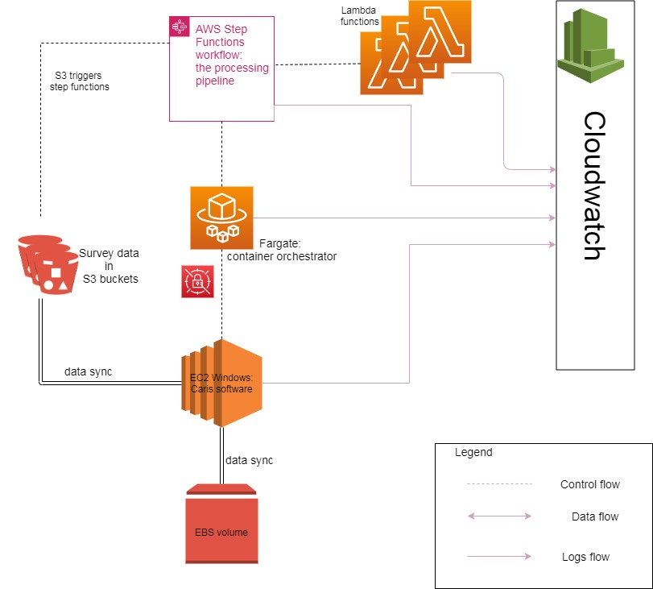

<!-- omit in toc -->
# Contents
- [Introduction](#introduction)
- [Architecture](#architecture)
  - [GDAL](#gdal)
  - [MB-Systems](#mb-systems)
  - [PDAL](#pdal)
  - [CARIS](#caris)
- [Step functions](#step-functions)
- [Continuous Delivery](#continuous-delivery)
  - [Build + Publish](#build--publish)
  - [Deploy](#deploy)

# Introduction
AusSeabed is a national seabed mapping coordination program. The program aims to serve the Australian community that relies on seabed data by coordinating collection efforts in Australian waters and improving data access. 

This repository contains the code to process bathymetry products to cloud-based distributables. The terraform code for deploying the infrastructure is housed in the https://github.com/ausseabed/ausseabed-aws-foundation/ repository.

# Architecture

## GDAL
[https://github.com/OSGeo/gdal/tree/master/gdal/docker]
Supported methods:
* create_hillshade.sh: Create a hillshade from a S3 location GeoTiff and copy result to S3
* overlays.sh: Create a Cloud Optimised Geotiff (COG) from a S3 location GeoTiff and copy result to S3 - all the overlays and tiles are included in the one file
* polygon.sh: Create a shapefile outline of the raster region from a S3 location GeoTiff and copy result to S3
* exists.py: Test to see if the given filename exists in S3
* merge_polygon.py: Program merges a list of shapefiles using ogrmerge

***NB: The gdal shell scripts do not have proper shell encoding, so they are to be used in trusted environment only***

## MB-Systems
[https://hub.docker.com/r/mbari/mbsystem]
Supported methods:
* convert-to-las.sh: Convert a mbsystem recognised file to .LAS format and copy the result to S3

## PDAL
[https://hub.docker.com/r/pdal/pdal]
Supported methods:
* create-extent-coverage.sh: Create a polygon extent that tightly surrounds the .LAS points 

## CARIS
There are two other supporting code repos:
1. https://github.com/GeoscienceAustralia/ausseabed-caris-ami (used for creating an AWS AMI with Caris installed)
2. https://github.com/GeoscienceAustralia/ausseabed-caris-container (**not-used** - for creating a docker image with Caris installed)

Guides:
* [Developers guide](./docs/dev_guide.md): If you are starting as a developer in this project this document will be useful.
* [Users guide](./docs/user_guide.md): If you are a hydrographer or a someone processing surveys this guide will be useful

# Step functions
The processing pipeline contained 4 active workflows (Nov 2020)

The L3 Processing Pipeline takes GeoTiffs that come in an unspecified form and translates them into cloud optimised geotiffs, with presentation hillshades and polygon boundaries. 

The L2 Processing Pipeline takes .csar files and translates them into geotiffs/bag files 

The Produce Polygon pipeline takes .all files and translates them into polygons (via point cloud .las)

# Continuous Delivery
The continuous integration server (CircleCI) compiles, publishes and deploys the Product Catalogue to the development environmen. At the time of writing, deployment to production was a manual process.
## Build + Publish
The CI server builds the docker containers and publishes them to non-production environment on any commit to master. For deployment to the production environment, these images must be manually copied to the production AWS ECR account 
## Deploy
The Step Functions use the latest version of containers. So once, a container is deployed to ECR, it will be used in any new Step Function workflows.
